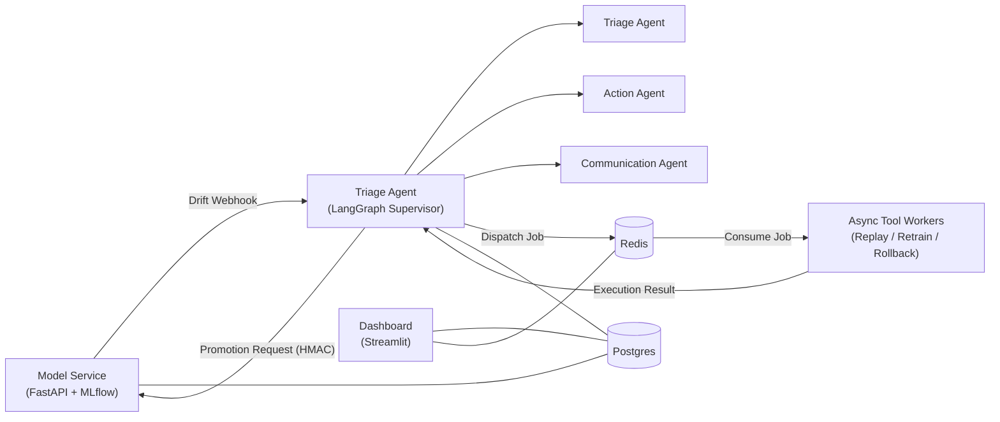

# Architecture

## Architecture Status

This document describes both the **implemented system** and the **target architecture**.

- **Implemented** — exists in the current codebase and is exercised by tests or runtime workflows.
- **Target** — part of the intended architecture but not implemented in the current release.
- **Partially Implemented** — the component exists and runs, but some of the responsibilities described for it below are still target-only.

Unless otherwise stated, component sections should be read according to their status marker. For the diagram of what actually runs today, see the [README's System Architecture section](README.md#system-architecture) — the diagram below is the target design this document builds toward.

## Overview

This platform provides an end-to-end operational workflow for monitoring production machine learning models, investigating drift, coordinating human-in-the-loop (HIL) decisions, and executing remediation actions safely. The architecture separates responsibilities across dedicated services: the Model Service owns model lifecycle and registry state, the Triage Agent owns orchestration and investigations, Redis provides asynchronous execution, and Postgres serves as the durable system of record.

---

## Component Diagram — Target

Today, `MS` loads a real registered model from MLflow at startup and emits a real HMAC-signed drift webhook. `TA` is a single-node graph (not a supervisor with `T`/`A`/`C` sub-agents), the promotion request path does not exist, and `W` consumes only retrain jobs (not replay/rollback).

---

# Components

## Model Service — Partially Implemented

**Responsibility**

The Model Service is the authoritative owner of the machine learning lifecycle. It manages model training, inference, MLflow registry operations, drift computation, and promotion validation.

### Owns

**Implemented today:**
- MLflow Registry — read path only: resolves and loads a registered model version at startup (`model_service/registry.py`, `main.py`'s `lifespan`), fails fast if the registry is empty or the artifact is structurally invalid. Does **not** perform registration — that happens in `training/train.py`, a separate host-side component.

**Target, not yet built:**
- Model training (owned by the separate `training/` subsystem, not the Model Service process)
- Model inference (no `/predict` endpoint)
- Drift computation (the debug endpoint emits a deterministic hardcoded signal, not PSI/χ² against live traffic)
- Drift reports (no persisted drift-report table)
- Promotion validation and model promotion (no promotion endpoint exists)
- Registry state persisted to Postgres (the Model Service has no Postgres connection at all today — it queries MLflow directly, statelessly, on each need)

---

## Triage Agent — Partially Implemented

**Responsibility**

The Triage Agent orchestrates investigations using LangGraph. It receives drift notifications, analyzes reports, coordinates human approval, dispatches remediation actions, and submits validated promotion requests to the Model Service.

### Sub-agents

#### Single-node investigation graph — Implemented

What actually exists today is a single LangGraph node, `initialize_investigation`, wired `START → initialize_investigation → END`. On a verified webhook it:

- deduplicates by `report_id`;
- atomically creates an investigation record;
- persists the initial LangGraph checkpoint;
- dispatches a retrain job to Redis.

It does not analyze severity, generate a recommendation, or reason with an LLM — that's the multi-agent design below.

#### Triage Agent (analysis sub-agent) — Target

Intended responsibility once built: analyzing drift reports, assessing investigation severity, producing recommendations.

#### Action Agent — Target

Intended responsibility once built: selecting the appropriate remediation strategy, dispatching replay/retrain/rollback jobs, monitoring asynchronous execution.

#### Communication Agent — Target

Intended responsibility once built: generating investigation summaries, preparing HIL approval requests, updating investigation status for the Dashboard.

---

## Async Tool Workers — Partially Implemented

**Responsibility**

Async workers execute long-running operational tasks dispatched by the Agent. Workers consume replay, retrain, and rollback jobs from Redis while enforcing idempotent execution.

**Implemented today:** retrain job consumption from a Redis Streams consumer group, with atomic idempotency claiming in Postgres before execution begins (see `DECISIONS.md`, Decision 3). Execution itself is a stub — it does not invoke `training/train.py`.

**Target:** replay and rollback job types; retry backoff and dead-letter movement for failed/abandoned messages.

---

## Dashboard — Implemented

**Responsibility**

The Dashboard provides operational visibility into the platform. It exposes model registry status, investigations, approvals, asynchronous job state, and Dead Letter Queue (DLQ) activity. The Dashboard is read-oriented and is never the source of truth.

In its current form it reads investigations and their latest retrain-job status from Postgres. Model registry status, approvals, and DLQ activity are target — there is no approvals or DLQ data model yet for it to read.

---

# Data Model

## Model Service (Postgres) — Target

None of the tables below exist yet. The Model Service currently has no Postgres connection; its only durable state is what's already stored in MLflow itself (registered model versions, their tags, and run metadata).

### Registry Metadata

Stores:

- Model name
- Model version
- Model URI
- Current stage
- Artifact digest
- Creation timestamp
- Update timestamp

**Purpose**

Represents the authoritative state of every registered model.

---

### Current Drift State

Stores:

- `latest_report_id`
- `latest_computed_severity`
- `last_notified_severity`
- Last drift computation timestamp

**Purpose**

Represents the latest known drift state for each model.

Every completed drift computation updates this record, regardless of whether a webhook is emitted.

Keeping **computed severity** separate from **last notified severity** allows webhook emission only when overall severity increases while still maintaining an accurate view of the current system state.

---

### Drift Reports

Stores:

- `report_id`
- Model name
- Model version
- Overall severity
- Per-signal metrics
- Human-readable summary
- Computation timestamp

**Purpose**

Maintains the historical evidence used by investigations, audits, replay analysis, and future comparisons.

---

### Promotion Requests

A single table serves both **idempotency** and **audit**.

Stores:

- `promotion_request_id`
- Model name
- Model version
- Model URI
- Artifact digest
- Source stage
- Target stage
- `based_on_report_id`
- Approver `user_id`
- Request status
- Failure reason
- Previous stage
- Resulting stage
- Created timestamp
- Started timestamp
- Completed timestamp

**Purpose**

Each row represents one promotion attempt.

The unique `promotion_request_id` prevents duplicate execution while simultaneously acting as the audit trail for that promotion.

---

## Triage Agent (Postgres)

The Agent owns workflow state rather than model state.

### Investigations — Implemented

Stores:

- `investigation_id`
- LangGraph `thread_id`
- Model URI
- Triggering report ID
- Current report ID
- Investigation status
- Recommendation
- Resolution
- Created timestamp
- Updated timestamp
- Resolved timestamp
- Stale / invalidation reason

**Purpose**

Provides the Dashboard with a queryable investigation index.

Investigations are optimized for searching, filtering, sorting, and reporting.

The current schema is a subset of the fields above — `recommendation`, `resolution`, and the stale/invalidation reason are columns reserved for the target multi-agent workflow and are not populated today.

---

### LangGraph Checkpoints — Implemented

Stores:

- Serialized graph state
- Active node
- Pending interrupts
- Tool outputs
- Execution metadata

**Purpose**

Allows interrupted workflows to resume execution from the latest checkpoint.

Checkpoints are **not** intended to answer operational queries such as:

- Show all open investigations
- Show investigations awaiting approval
- Show investigations for a specific model

Those queries are served by the Investigation table.

---

### Recommendations — Target

Stores:

- Recommendation ID
- Investigation ID
- `based_on_report_id`
- Recommendation
- Status
- Created timestamp
- Superseded timestamp

**Purpose**

Ensures every recommendation is tied to the exact drift report that produced it.

---

### Human Approvals — Target

Stores:

- Approval ID
- Recommendation ID
- Investigation ID
- Approver `user_id`
- Decision
- Decision timestamp
- Optional comment

**Purpose**

Approvals are bound to a specific recommendation.

If the recommendation becomes stale, the approval is automatically considered invalid and cannot be reused.

---

### Webhook Receipts — Implemented

Stores:

- `report_id`
- Processing status
- Investigation reference
- Received timestamp
- Processed timestamp
- Failure reason

**Purpose**

Provides webhook idempotency.

Webhook delivery and investigation lifecycle are different concerns and therefore intentionally use separate records.

---

### Async Job Records — Implemented

Stores:

- `retrain_job_id`
- Investigation ID
- Job status
- Worker claim timestamp
- Started timestamp
- Completed timestamp
- Attempt count
- Result

**Purpose**

Provides durable idempotency for expensive background jobs.

Workers atomically claim the job before execution, preventing duplicate training runs during retries or worker restarts.

This is the `retrain_jobs` table. "Expensive background job" is aspirational today — the worker performs a stub execution rather than invoking real training.

---

### Promotion Dispatch — Target

Stores:

- `promotion_request_id`
- Recommendation ID
- Approval ID
- Dispatch status
- Retry count
- Model Service response

**Purpose**

Tracks outbound promotion requests independently from registry execution.

---

## Redis — Partially Implemented

Redis is responsible only for asynchronous execution.

Contains:

- ~~Replay queue~~ — target
- Retrain queue — **implemented** (Redis Streams, consumer group, idempotent claim)
- ~~Rollback queue~~ — target
- ~~Retry scheduling~~ — target
- Worker leases — implemented implicitly via Redis Streams consumer-group pending-entry semantics, not a custom lease mechanism
- ~~Dead Letter Queue (DLQ)~~ — target

Redis is **not** durable business storage.

---

## Postgres

Postgres is the platform's durable system of record for what's actually built: investigations, webhook receipts, and retrain (async) job records, plus the LangGraph checkpoint tables. The remaining items below (drift reports, current drift state, promotion requests, recommendations, human approvals, and promotion dispatch) are target and have no migration yet.

It stores:

- ~~Drift reports~~ — target
- ~~Current drift state~~ — target
- ~~Promotion requests~~ — target
- Investigations — implemented
- LangGraph checkpoints — implemented
- ~~Recommendations~~ — target
- ~~Human approvals~~ — target
- Webhook receipts — implemented
- Async job records — implemented

---

# Source of Truth

Each domain has a single authoritative owner. This table describes the target design; today, only the Investigations, Workflow Execution, and Queue Delivery rows have a live implementation behind them — the Model Registry and Drift State rows describe MLflow's registry (which is real) but not a Postgres-backed drift-state table (which is target).

| Domain | Source of Truth |
|----------|-----------------|
| Model Registry | Model Service / MLflow |
| Drift State | Model Service |
| Investigations | Agent (Postgres) |
| Workflow Execution | LangGraph Checkpoints |
| Queue Delivery | Redis |

The platform does **not** attempt to keep cached or checkpointed state synchronized with live state.

Instead, every consequential action validates against its authoritative source immediately before execution.

Examples:

- Promotion validates `based_on_report_id` against the latest `report_id`. *(target)*
- Checkpoint resume validates the stored model URI against the live registry. *(target)*
- Retraining atomically claims the durable job record before execution. *(implemented)*

---

# Contracts

See **`DECISIONS.md`** for detailed design decisions, including:

- Drift webhook contract
- Promotion endpoint contract
- Idempotency strategy
- Staleness validation
- Human approval workflow
