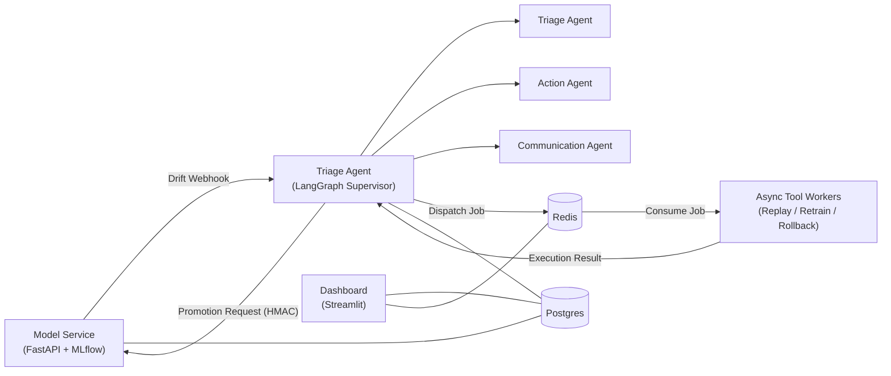

# Architecture

## Overview

This platform provides an end-to-end operational workflow for monitoring production machine learning models, investigating drift, coordinating human-in-the-loop (HIL) decisions, and executing remediation actions safely. The architecture separates responsibilities across dedicated services: the Model Service owns model lifecycle and registry state, the Triage Agent owns orchestration and investigations, Redis provides asynchronous execution, and Postgres serves as the durable system of record.

---

## Component Diagram

---

# Components

## Model Service

**Responsibility**

The Model Service is the authoritative owner of the machine learning lifecycle. It manages model training, inference, MLflow registry operations, drift computation, and promotion validation.

### Owns

- Model training
- Model inference
- MLflow Registry
- Drift computation
- Drift reports
- Promotion validation
- Model promotion
- Registry state

---

## Triage Agent

**Responsibility**

The Triage Agent orchestrates investigations using LangGraph. It receives drift notifications, analyzes reports, coordinates human approval, dispatches remediation actions, and submits validated promotion requests to the Model Service.

### Sub-agents

#### Triage Agent

Responsible for:

- Analyzing drift reports
- Assessing investigation severity
- Producing recommendations

#### Action Agent

Responsible for:

- Selecting the appropriate remediation strategy
- Dispatching replay, retrain, and rollback jobs
- Monitoring asynchronous execution

#### Communication Agent

Responsible for:

- Generating investigation summaries
- Preparing Human-in-the-Loop approval requests
- Updating investigation status for the Dashboard

---

## Async Tool Workers

**Responsibility**

Async workers execute long-running operational tasks dispatched by the Agent. Workers consume replay, retrain, and rollback jobs from Redis while enforcing idempotent execution.

---

## Dashboard

**Responsibility**

The Dashboard provides operational visibility into the platform. It exposes model registry status, investigations, approvals, asynchronous job state, and Dead Letter Queue (DLQ) activity. The Dashboard is read-oriented and is never the source of truth.

---

# Data Model

## Model Service (Postgres)

The Model Service owns all persistent state related to model lifecycle and promotion safety.

### Registry Metadata

Stores:

- Model name
- Model version
- Model URI
- Current stage
- Artifact digest
- Creation timestamp
- Update timestamp

**Purpose**

Represents the authoritative state of every registered model.

---

### Current Drift State

Stores:

- `latest_report_id`
- `latest_computed_severity`
- `last_notified_severity`
- Last drift computation timestamp

**Purpose**

Represents the latest known drift state for each model.

Every completed drift computation updates this record, regardless of whether a webhook is emitted.

Keeping **computed severity** separate from **last notified severity** allows webhook emission only when overall severity increases while still maintaining an accurate view of the current system state.

---

### Drift Reports

Stores:

- `report_id`
- Model name
- Model version
- Overall severity
- Per-signal metrics
- Human-readable summary
- Computation timestamp

**Purpose**

Maintains the historical evidence used by investigations, audits, replay analysis, and future comparisons.

---

### Promotion Requests

A single table serves both **idempotency** and **audit**.

Stores:

- `promotion_request_id`
- Model name
- Model version
- Model URI
- Artifact digest
- Source stage
- Target stage
- `based_on_report_id`
- Approver `user_id`
- Request status
- Failure reason
- Previous stage
- Resulting stage
- Created timestamp
- Started timestamp
- Completed timestamp

**Purpose**

Each row represents one promotion attempt.

The unique `promotion_request_id` prevents duplicate execution while simultaneously acting as the audit trail for that promotion.

---

## Triage Agent (Postgres)

The Agent owns workflow state rather than model state.

### Investigations

Stores:

- `investigation_id`
- LangGraph `thread_id`
- Model URI
- Triggering report ID
- Current report ID
- Investigation status
- Recommendation
- Resolution
- Created timestamp
- Updated timestamp
- Resolved timestamp
- Stale / invalidation reason

**Purpose**

Provides the Dashboard with a queryable investigation index.

Investigations are optimized for searching, filtering, sorting, and reporting.

---

### LangGraph Checkpoints

Stores:

- Serialized graph state
- Active node
- Pending interrupts
- Tool outputs
- Execution metadata

**Purpose**

Allows interrupted workflows to resume execution from the latest checkpoint.

Checkpoints are **not** intended to answer operational queries such as:

- Show all open investigations
- Show investigations awaiting approval
- Show investigations for a specific model

Those queries are served by the Investigation table.

---

### Recommendations

Stores:

- Recommendation ID
- Investigation ID
- `based_on_report_id`
- Recommendation
- Status
- Created timestamp
- Superseded timestamp

**Purpose**

Ensures every recommendation is tied to the exact drift report that produced it.

---

### Human Approvals

Stores:

- Approval ID
- Recommendation ID
- Investigation ID
- Approver `user_id`
- Decision
- Decision timestamp
- Optional comment

**Purpose**

Approvals are bound to a specific recommendation.

If the recommendation becomes stale, the approval is automatically considered invalid and cannot be reused.

---

### Webhook Receipts

Stores:

- `report_id`
- Processing status
- Investigation reference
- Received timestamp
- Processed timestamp
- Failure reason

**Purpose**

Provides webhook idempotency.

Webhook delivery and investigation lifecycle are different concerns and therefore intentionally use separate records.

---

### Async Job Records

Stores:

- `retrain_job_id`
- Investigation ID
- Job status
- Worker claim timestamp
- Started timestamp
- Completed timestamp
- Attempt count
- Result

**Purpose**

Provides durable idempotency for expensive background jobs.

Workers atomically claim the job before execution, preventing duplicate training runs during retries or worker restarts.

---

### Promotion Dispatch

Stores:

- `promotion_request_id`
- Recommendation ID
- Approval ID
- Dispatch status
- Retry count
- Model Service response

**Purpose**

Tracks outbound promotion requests independently from registry execution.

---

## Redis

Redis is responsible only for asynchronous execution.

Contains:

- Replay queue
- Retrain queue
- Rollback queue
- Retry scheduling
- Worker leases
- Dead Letter Queue (DLQ)

Redis is **not** durable business storage.

---

## Postgres

Postgres is the platform's durable system of record.

It stores:

- Drift reports
- Current drift state
- Promotion requests
- Investigations
- LangGraph checkpoints
- Recommendations
- Human approvals
- Webhook receipts
- Async job records

---

# Source of Truth

Each domain has a single authoritative owner.

| Domain | Source of Truth |
|----------|-----------------|
| Model Registry | Model Service / MLflow |
| Drift State | Model Service |
| Investigations | Agent (Postgres) |
| Workflow Execution | LangGraph Checkpoints |
| Queue Delivery | Redis |

The platform does **not** attempt to keep cached or checkpointed state synchronized with live state.

Instead, every consequential action validates against its authoritative source immediately before execution.

Examples:

- Promotion validates `based_on_report_id` against the latest `report_id`.
- Checkpoint resume validates the stored model URI against the live registry.
- Retraining atomically claims the durable job record before execution.

---

# Contracts

See **`DECISIONS.md`** for detailed design decisions, including:

- Drift webhook contract
- Promotion endpoint contract
- Idempotency strategy
- Staleness validation
- Human approval workflow