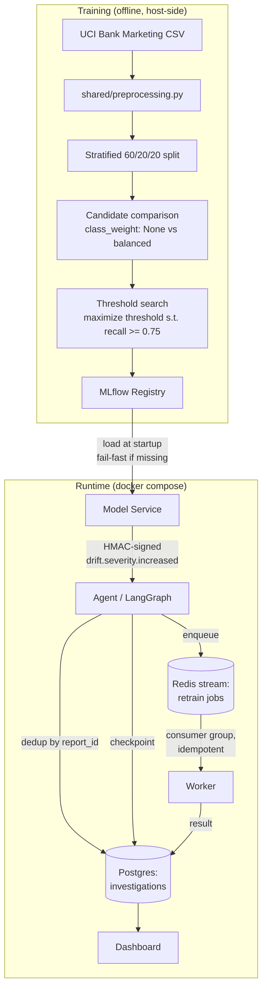
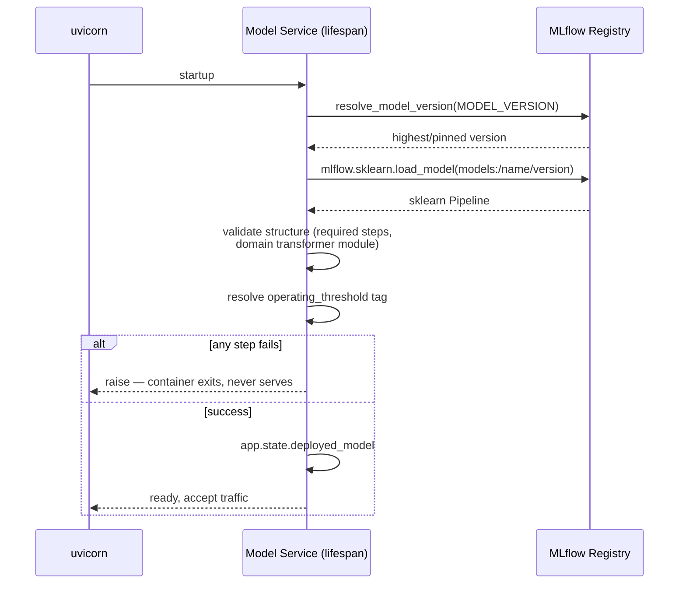

# Drift Triage Copilot

**A self-healing MLOps platform**: a real, registered ML model is trained, versioned, and served; when it drifts, an LLM agent investigates, opens a human-reviewable case, and dispatches an automated retraining job — all as a distributed system of independently deployed services, not a notebook.

[](https://github.com/Bahaamehyeldine/drift-triage-copilot/actions/workflows/ci.yml)


---

## Why this exists

Most "MLOps demo" repos stop at `model.fit()`. This one asks the harder question: **what happens after the model is deployed and the world changes underneath it?**

Concretely, it builds the full loop:

1. A model is trained with a documented, reproducible methodology — not just accuracy, but a business-defined operating threshold (`recall ≥ 0.75`) selected on validation data, with the test set touched exactly once.
2. The model is registered in **MLflow**, not pickled to a file — versioned, tagged with its threshold and full training provenance (dataset hash, split composition, git commit), and loadable by any service that needs it.
3. A **Model Service** loads that registered artifact at startup, fails fast if it can't, and emits drift signals as HMAC-signed webhooks.
4. An **Agent** (LangGraph) receives the webhook, deduplicates it, opens an investigation, and persists a durable checkpoint of its reasoning.
5. A **Worker** consumes retraining jobs from a Redis stream with idempotent, at-least-once processing.
6. A **Dashboard** shows the resulting state.

Model Service, Agent, Worker, and Dashboard are each a real containerized service — own Dockerfile, own locked dependency set, own unit tests — connected by explicit contracts (webhook schema, HMAC auth, `report_id`-based dedup) rather than a shared import. Training runs host-side and MLflow is self-hosted infrastructure; both are exercised for real by the integration smoke test, just not unit-tested the same way.

---

## System architecture



### Model Service startup — registry-backed, fail-fast



No local pickles. No hardcoded model identity. If the registry doesn't have a valid, structurally-correct artifact, the container refuses to start — proven by actually deleting the MLflow volume mid-session and watching it crash-loop with a clear `RuntimeError`, then recover once a model was registered.

---

## Technology stack

| Layer | Choice | Why |
|---|---|---|
| Model training | scikit-learn (`LogisticRegression`) | Interpretable baseline; the point of this project is the *lifecycle*, not model complexity |
| Experiment tracking / registry | MLflow (self-hosted, own `docker-compose` service) | Single source of truth for model identity, metrics, and threshold — not a side file |
| Agent orchestration | LangGraph + Postgres checkpointer | Durable, replayable investigation state |
| Serving | FastAPI + Uvicorn | Async, typed, self-documenting (OpenAPI) |
| Queue | Redis Streams, consumer groups | At-least-once delivery with idempotent workers |
| Storage | Postgres (investigations, checkpoints) | Relational integrity for audit trail |
| Dashboard | Streamlit | Fast to build, sufficient for internal tooling |
| Dependency management | `uv pip compile` per service | Every service locks its *own* minimal dependency set — Model Service doesn't ship pandas' full transitive tree, `mlflow-skinny` instead of the full server package |
| CI | GitHub Actions: ruff (lint + format), pytest, full docker-compose smoke test | Every merge to `main` proves the *distributed system* works, not just unit tests |

---

## Repository structure

```
.
├── training/              # Offline: dataset → preprocessing → split → candidates → threshold → registration
│   ├── train.py           # Candidate comparison, threshold selection, MLflow registration + provenance
│   ├── evaluate.py        # One-time, guarded final test-set evaluation (cannot be re-run against a version)
│   └── preprocess.py      # sklearn Pipeline construction (imports the transformer from shared/)
├── shared/
│   └── preprocessing.py   # BankMarketingFeatureTransformer — owned here so both training/ and
│                           # model_service/ can deserialize the same registered artifact
├── model_service/         # FastAPI: loads the registered model at startup, emits drift webhooks
│   ├── main.py             # lifespan startup, artifact validation, /debug/drift
│   └── registry.py         # MLflow version resolution (latest | pinned), isolated from FastAPI on purpose
├── agent/                 # FastAPI + LangGraph: webhook receiver, investigation, checkpointing
├── worker/                # Redis-stream consumer: idempotent retraining job execution
├── dashboard/              # Streamlit: investigation state viewer
├── mlflow/                 # Self-hosted MLflow server (own Dockerfile — SQLite backend, proxied artifacts)
├── migrations/              # Alembic
├── tests/
│   ├── unit/                # Per-service unit tests
│   └── integration/
│       └── smoke_test.sh    # Full docker-compose lifecycle: infra → migrations → MLflow + model
│                             # registration → services → webhook → dedup → retrain → dashboard
├── docker-compose.yml
└── ARCH.md / DECISIONS.md / MVP_SCOPE.md / RUNBOOK.md   # Living design documents
```

---

## Quick start

```bash
git clone git@github.com:Bahaamehyeldine/drift-triage-copilot.git
cd drift-triage-copilot
cp .env.example .env   # set DRIFT_WEBHOOK_SECRET at minimum

# Train and register a model (host-side, one-time)
uv run --with-requirements training/requirements.txt python3 -m training.train

# Bring up the full stack
docker compose up -d

# Trigger a deterministic drift event end-to-end
curl -sS -X POST http://localhost:8020/debug/drift
```

Then open the Dashboard at `http://localhost:8520` and the MLflow UI at `http://localhost:5000` to see the investigation and the registered model, respectively.

To run the same thing CI runs:

```bash
bash tests/integration/smoke_test.sh
```

---

## Training pipeline and model selection

The full methodology, run for real (not illustrative):

| Step | Detail |
|---|---|
| Split | Stratified 60/20/20 train/validation/test, fixed `random_state`, integrity-checked (no row overlap, no lost rows) |
| Candidates | `class_weight=None` vs `class_weight="balanced"`, identical preprocessing and hyperparameters otherwise — a controlled comparison, not a grid search |
| Operating threshold | Selected on **validation only**: the highest threshold satisfying `recall >= 0.75`, a business constraint, not a model-quality metric |
| Selection | `class_weight="balanced"` won on F1, precision, *and* AUC — not just a tiebreak |
| Test set discipline | Evaluated **exactly once**, guarded in code: `evaluate.py` refuses to re-run against a model version that's already been evaluated, and independently verifies the dataset hash, split-membership hash, and git commit match what the registered model was actually trained on |

**Frozen final result** (`bank-marketing-classifier`, registered in MLflow with full provenance):

| Metric | Validation | Test |
|---|---|---|
| Threshold | 0.385777 | *(frozen from validation)* |
| ROC AUC | 0.8017 | 0.8012 |
| Precision | 0.2468 | 0.2479 |
| Recall | 0.7500 | 0.7478 |
| F1 | 0.3714 | 0.3723 |

Test recall (0.7478) landing just under the validation-selected 0.75 constraint is the expected, honest outcome of holding out a real test set — and exactly the scenario the guard rails in this pipeline exist to protect against tuning away.

Every registered model version carries, as MLflow tags: `operating_threshold`, `dataset_sha256`, `split_spec_sha256`, `split_membership_sha256`, `git_commit_sha`, `git_worktree_dirty` — so any registered artifact's exact training provenance is independently reconstructible.

### Inspecting individual predictions

A small demonstration utility loads the registered model directly from MLflow and runs inference on a handful of examples:

```bash
uv run --with-requirements training/requirements.txt \
    python3 -m training.predict_examples
```

It reports the predicted probability, operating threshold, predicted label, and ground-truth label for several examples drawn from the **validation** split — intentionally, not test. The test partition remains sealed after the one-time final evaluation.

---

## CI pipeline

Every push to `main` runs, in order: `ruff check` → `ruff format --check` → `pytest tests/unit` → the **full integration smoke test** (`docker compose` bringing up all 8 services — `postgres`, `redis`, `mlflow`, `migrate`, `agent`, `worker`, `model_service`, `dashboard` — training and registering a real model, triggering the webhook, and asserting on persisted database state for investigation creation, deduplication, checkpoint persistence, retraining, and HMAC rejection).

See [`.github/workflows/ci.yml`](.github/workflows/ci.yml).

---

## Design documents

- [`ARCH.md`](ARCH.md) — component ownership boundaries and source-of-truth table
- [`DECISIONS.md`](DECISIONS.md) — the webhook contract, promotion endpoint, and the reasoning behind each
- [`MVP_SCOPE.md`](MVP_SCOPE.md) — what the walking-skeleton phase deliberately excluded, and what came after
- [`RUNBOOK.md`](RUNBOOK.md) — operational playbook

---

## Live inference

Model Service exposes a real `POST /predict` endpoint — not a stub. It runs the registered pipeline's `predict_proba` against the request and applies the frozen operating threshold, the same one selected during training:

```bash
curl -sS -X POST http://localhost:8020/predict \
  -H "Content-Type: application/json" \
  -d '{
    "age": 35, "job": "technician", "marital": "married",
    "education": "university.degree", "default": "no", "housing": "yes",
    "loan": "no", "contact": "cellular", "month": "may", "day_of_week": "mon",
    "duration": 250, "campaign": 2, "pdays": 999, "previous": 0,
    "poutcome": "nonexistent", "emp.var.rate": 1.1, "cons.price.idx": 93.994,
    "cons.conf.idx": -36.4, "euribor3m": 4.857, "nr.employed": 5191.0
  }'
```

```json
{"model_name":"bank-marketing-classifier","model_version":"1","probability":0.3149,"threshold":0.385777,"prediction":0,"prediction_label":"no"}
```

The request schema intentionally matches the raw UCI dataset's columns exactly — including `duration` — because that is what the trained pipeline's domain transformer expects to receive. **`duration` is accepted but never used**: it is a known leakage feature (call duration is only knowable after a call ends), and `shared/preprocessing.py` drops it before the classifier ever sees it. This is documented directly on the field in the OpenAPI schema (`/docs`), not left as a silent unused parameter.

The Dashboard (`http://localhost:8520`) has a "Try the Model" form that calls this same endpoint — the Dashboard never loads MLflow or the pipeline itself, it is purely an HTTP client, same as it's a read-only client to Postgres for investigations. The CI smoke test also calls `/predict` directly and re-derives the expected decision from the returned probability and threshold independently, rather than trusting the service applied its own threshold correctly.

## What's deliberately not built (yet)

This project optimizes for a complete, correct *lifecycle* over feature breadth. Explicitly out of scope for now:

- Real drift computation (PSI/χ² against live traffic) — the debug endpoint emits a deterministic signal for testing the downstream pipeline
- Kubernetes, Prometheus/Grafana, a feature store, distributed training
- A model promotion workflow (contract already documented in `DECISIONS.md`, not yet implemented)

None of these change the core claim of the project — that the model lifecycle from training through registry through serving through incident response is real, tested, and reproducible — so they're not the next thing to add.

## Roadmap

- [ ] Live PSI/χ² drift computation replacing the deterministic debug signal
- [ ] Model promotion workflow (human-approved, HMAC-authenticated, idempotent — contract already documented in `DECISIONS.md`)
- [ ] `class_weight` sweep beyond the two-candidate comparison, once a second real dataset justifies it

## Lessons learned

- **A clean-looking test pass can hide an empty artifact.** `training/evaluate.py` was committed with zero content for three commits — `ruff check`/`ruff format` both pass trivially on an empty file, and nothing failed until the file was actually read. The fix wasn't better tooling, it was checking file size, not just exit codes.
- **Infrastructure that "works from the host" isn't proven.** MLflow's default DNS-rebinding protection only trusts `localhost` and private IPs — every test done against `localhost:5000` passed, and the very first time `model_service` reached it over the Docker network (`http://mlflow:5000`) it got a 403. The fix required reading MLflow's own security middleware source, not guessing.
- **Moving code changes its identity.** Extracting `BankMarketingFeatureTransformer` into `shared/` changed the class's `__module__` at pickle time — a fresh model had to be trained and registered under the new path before `model_service` (which has no access to `training/`) could deserialize it at all.
- **`bash -n` proves a script parses, not that it does the right thing.** A smoke-test assertion embedded a Python f-string using single quotes (`body['model_name']`) inside an outer *bash* single-quoted block. Bash single quotes have no escape mechanism at all, so that character silently closed and reopened the string mid-block — `bash -n` still reported clean syntax because the quotes happened to balance across the whole block, even though the argument actually passed to `python3` was garbled. The fix was extracting the values to plain variables first and interpolating those, avoiding nested quoting entirely.

---

## License

MIT — see [`LICENSE`](LICENSE).
